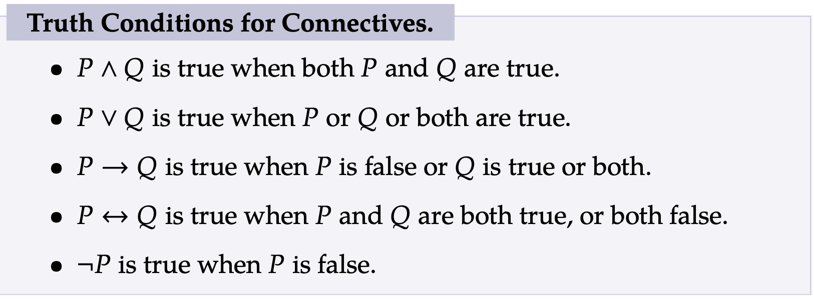
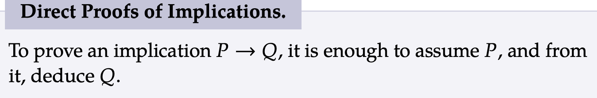
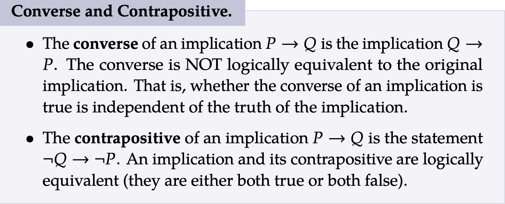

# Notes

## .1
<ul>
<li> Discrete Math is hard to define but it can be simplified to math that is individually seperate and distinct </li>
<li>Discrete Mathmatics covers a broad range of subjects for example: </li>
<ol>
    <li> Combinatorics (theory on how things combine)</li>
    <li> Sequences</li>
    <li> Symbolic Logic</li>
    <li> Graph Theory</li>
    <li> Game Theory</li>
    <li> Probability</li>
</ol></ul>
<h2> .2 </h2>
<ul>
    <li>A statement is any declarative sentence which is either true or false, it cannot be neither</li>
    <li>It is considered atomic if it cannot be split up anymore </li>
    <li>If it can be split up then it is molecular. The following statements are considered atomic: </li>
    <ol>
        <li>Telephone numbers in the USA have 10 digits</li>
        <li>Trostin is 4' tall</li>
        <li>HTML stands for Hypertext Markup Language</li>
    </ol>
    <li>You can make a sentence (3+x = 9) into a statement by elaborating (3+x=9 where x = 6)or quantifying it (for all values of x, 3+x=9)</li>
    <li>Logical connectives can be used to create molecular statements</li>
    <li>"Telephone numbers in the USA have 10 digits and 42 is a perfect
square" this is a molecular statement due to the logical connective 'and' being present</li>
    <li>'and', 'or', 'if ..., then..', 'if and only if', are all binary connectives meaning that they connect two statements</li>
    <li>'not' is a unary connective since it only applies to one statement </li>
    <li>The truth value of a statement will vary depening on the logical connectives</li>
    <li>Propositional variables (sometimes called sentential variables), usually
capital letters in the middle of the alphabet: P, Q, R, S, . . .. We think of
these as standing in for (usually atomic) statements </li>
    <li> Propositional variables can only have two values true or false</li>
    <li>There are symbols for the logical connnectives ∧, ∨, →, ↔, ¬ </li>
    <li>P ∨ Q is read “P or Q,” and called a disjunction</li>
    <li>P ∧ Q is read “P and Q,” and called a conjunction</li>
    <li>P → Q is read “if P then Q,” and called an implication or
conditional </li>
    <li>P ↔ Q is read “P if and only if Q,” and called a biconditional </li>
    <li>¬P is read “not P,” and called a negation </li>
    <li>The use of or is inclusive meaning that if both conditions are satisfied it's truth value is true not false</li>
    <li>Implications are only considered false if P is true with Q being false otherwise they are considered true. Let's consider if I were to say that if Trostin were to sleep more then he would recieve higher grades. Now if he were to not sleep more but stil recieve higher grades, what I said would not be false as I never said that he could only improve his grades through sleeping more, rather I stated his grades would improve if he were to sleep more. The only way to say that I'm wrong is if he were to sleep more and not improve his grades.</li>
    <li></li>
</ul>

<h2>Important Images:</h2>
</img>
  
</img>
  
</img>
<li> </li>