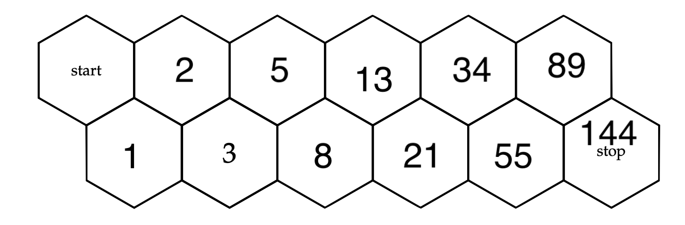

# Queen Bee Chess (Exercise 18)

## Problem 

    When bees play chess, they use a hexagonal board like the one shown below. The queen bee can move one  space at a time either directly to the right or angled up-right or down-right (but can never move leftwards). How many different paths can the queen take from the top left hexagon to the bottom right hexagon? Explain your answer, and this relates to the previous question. (As an example, there are three paths to get to the second hexagon on the bottom row.)

## Our solution

 </img>

    Our solution was that there was 144 paths that the queen bee can use. We found this through adding the previous two spaces number of paths for the new space (Fibonacci Sequence). We were able to verify this method would work as we started with a smaller pattern where we could verify our reasoning. 
    
    This is similar to question 17 as it also follows the Fibonacci Sequence. Moreover, the final number of paths to the end square, 144 is the same as the sum of the total amount of strings with certain lengths (Question 17 Part B.).

