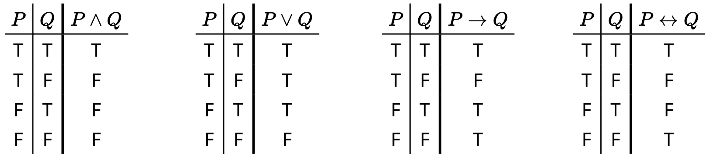
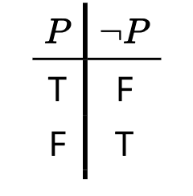
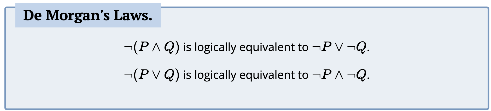
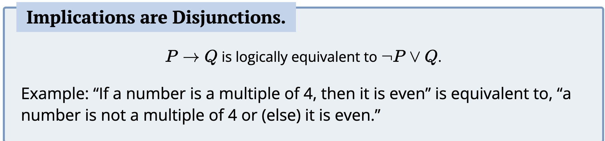

# Chapter 3 (Symbolic Logic and Proofs) Notes:

## .1
- A proposition is a statement
- Propositional Logic studies how statements interact with eachother, the content of the proposition is not relevant to propositional logic
- When creating truth tables for a statement you want to break it up a lot depending on the statement
- Toulogy is when a statement is true solely based on the logical form, they don't give us a lot of info as no matter what it is true.
- Statements are logically equivalent if their truth table is the same.
- If you rephrase a statement in a logically equivalent method it can lead to insight on how to prove or refute.
- you can use boolean algebra to transform statements into others
- We can use morgan's laws and the fact that implications can be rewritten as disjunctions (and double negatives) to rewrite statements into other without using logic tables
- A deduction rule is when we have two statements together (both are true) cause the statement in the bottom to be true.
- To deduce a deduction rule you need to make a logic table and look where the statements are true
- 

