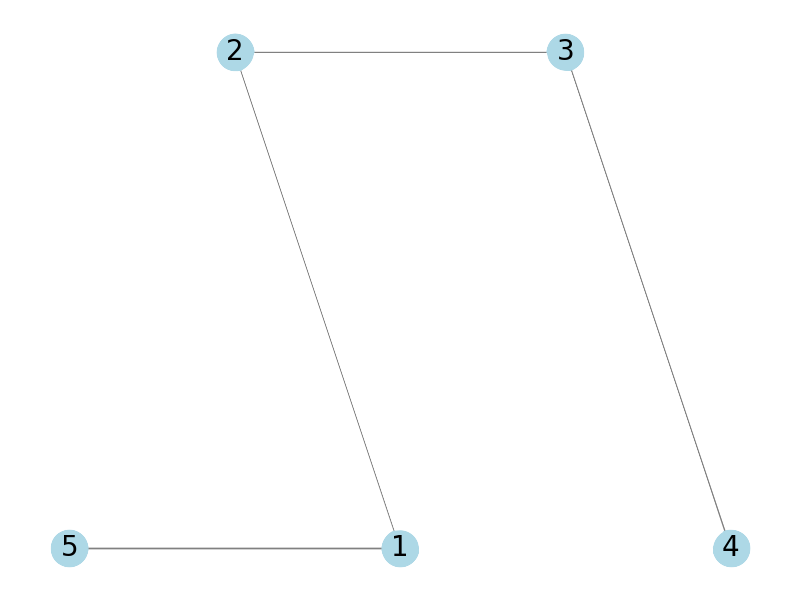

# Exercises
## 7.  (A) Why is a forest a good name?   (B) Suppose $F$ is a forest consisting of $m$ trees and $v$ vertices. How many edges does $F have? Explain  (C) Prove that any graph $G$ with $v$ vertices and $e$ edges that satisfies $v < e + 1$ must contain a cycle (i.e., not be a forest).

## 15. Prove that every connected graph which is not itself a tree must have at last three different (although possibly isomorphic) spanning trees.

Understand the following:
- A connected graph means that every vertex has an edge that connects it to the rest of the graph
- A tree is a connected graph in itself that simply contains no cycles (so no loops).
- A spanning tree is a subgraph that is a tree with all the vertices of the graph it was a connected subgraph of.
- **Graphs can contain multiple cycles, meaning that it has subgraphs of singular cycles**
- **A tree with vertices n has an edge amount of n-1, meaning the minimum edges a connected graph can have while still not being a tree is n**
- **The minimum of vertices needed to create a cycle is 3 as a cycle is a loop/path that starts and stops on the same vertex without containing repeated vertices.**
- Therefore if we prove that you can make 3 spanning trees from the minimum amount of vertices needed to create a cycle, this should be true.

Case 1:
In graph $G_1$ suppose it contains only a single cycle, it would have to contain $n$ amount of vertices and edges, else this would contradict what $G_1$ was stated to be. $G_1$ will have the minimum amount of vertices and edges to be a connected graph while not being a tree.

$G_1$ contains n edges meaning removing one edge will result in n-1 edges, which would mean it would be a spanning tree. There are 3 edges in $G_1$ meaning each one can be removed to form a new spanning tree, $T$. This is represented by the following:

Given this is the minimum amount of vertices needed for a cycle and that all graphs with a singluar cycle only need to remove one edge to become a spanning tree, every connected graph has at least three different spanning trees. 

Case 2:
Suppose $G$ is a graph with multiple cycles. This means it can be split up as subgraphs with only one cycle, which is why they would have at least more than 3 spanning trees. The only thing to be mindful of is that they would share edges in a graph with multiple cycles, so that would affect the amount of spanning trees, however it would still exceed 3 as there will be combinations of edge removals resulting in different spanning trees. Here is an example of this:

Given the following two cases considered, every connected graph has at least three different spanning trees. 

## 7 
### (A) We define a forest to be a graph with no cycles. Explain why this is a good name. That is, explain why a forest is a union of trees.
Other than having no cycles forests also don't need to have all vertices connected, while trees do.  If we were to have a forest with 3 disconnected groups of vertices, (all the vertices in a group are connected to eachother only) we could say that the forest is a union of three trees. After all, each if we were to take a subgraphs of the 3 groups it would result into 3 different trees.

### (B) Suppose F is a forest consisting of m trees and v vertices. How many edges does F have? Explain
A single tree has $n - 1$ edges. This is because in order for a tree to be connected there needs to enough edges for all vertices to be connected but also not too much for a cycle to occur. Anyway with this in mind as for each tree in the forest we would have one less edge there are $v-m$ edges in F.

### (C) Prove that any graph $G$ with $v$ vertices and $e$ edges that satisfies $v \leq e + 1$ must contain a cycle (i.e., not be a forest).

We give a proof through contrapositive. Suppose graph $G$ does not contain a cycle and contrary to stipulation, graph $G$ with $v$ vertices and $e$ edges does not satisfy the following statement: $v \leq e + 1$. Since $G$ does not contain a cycle it is either a tree or forest. Suppose if it were a tree then it would have v = e + 1, which is contrary to stipulation. However, if $G$ were a forest then we could view it as a forest consisting of $m$ trees (as a tree does not contain any cycles) meaning the number of edges would be $v - m  = e$, which is contrary to sipulation, proving this correct.  