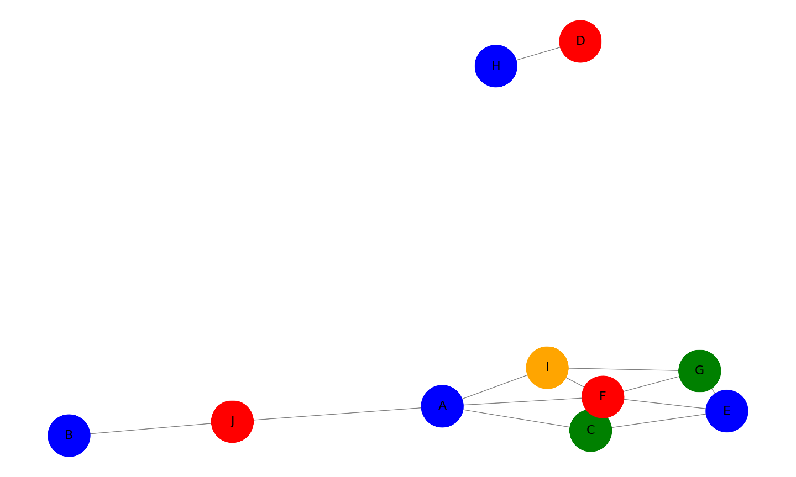

## Brooks' Theorem
Any graph $G$ satisfies $\chi(G) \le \Delta(G)\text{,}$ unless $G$ is a complete graph or an odd cycle, in which case $\chi(G) = \Delta(G) + 1\text{.}$.

## 4. A group of 10 friends decides to head up to a cabin in the woods (where nothing could possibly go wrong). Unfortunately, a number of these friends have dated each other in the past, and things are still a little awkward. To get to the cabin, they need to divide up into some number of cars, and no two people who dated should be in the same car.

### A. What is the smallest number of cars you need if all the relationships were strictly heterosexual? Represent an example of such a situation with a graph. What kind of graph do you get?

If all relationships were strictly heterosexual then one representation of this would be the following:

If we look at this for a bit we will realize this is a bipartite graph. After all, bipartite graphs are graphs where we can divide the vertices into 2 sets of the vertices where they only connect to vertices from the other set, and we can color the graph's vertices using only 2 colors. These two sets are males and females as we are considering only heterosexual relationships between the 10 friends. Therefore the smallest number of cars is 2.

### B. Because a number of these friends dated there are also conflicts between friends of the same gender, listed below. Now what is the smallest number of conflict-free cars they could take to the cabin?

|  Friend  | A   | B   | C   | D   |  E   | F   | G   | H   | I   | J   |
|----------|-----|-----|-----|-----|------|-----|-----|-----|-----|-----|
| Conflicts:| CFG | J| AEF | H | CFG| ACEGI | EFI|D|AFG|B|

This graph is planar as none of the edges cross eachother. Therefore using The Four Color Theorem we know that the maximum amount of colors needed would be 4. Moreover, we see there is a cllique of 3 (a complete graph $K_3$) so the minimum amount of colors needed is 3. To actually find out how much needed we can evaluate this graph with this new information, however we can also solve is using networkx greedy coloring algorithm.

