# Coloring 

Creators: Trostin, Luis, Johan, Caleb

**Coloring is the process of assigning a label, refered to as a color, to elements of a graph.**

## Coloring in General:
<b>Definition</b>: Coloring refers to the assignment of labels/colors to the subject of constraint. <b>Vertex coloring</b> is a more
commonly used type of coloring where each vertex has a color assigned to it, and no connected/adjacent vertices can have the same color (no
vertices that have an edge between them). In graphing, there is something called a <b>clique</b> in a graph is a set of vertices all of
which are pairwise adjacent which is practically a size n is just a copy of the complete graph Kn. From this the <b>clique number</b> of a
graph can be made which is the largest n for which the graph contains a clique of size n. The goal when coloring is often to find the
<b>chromatic number</b>, which is the smallest amount of numbers to complete the coloring task, or the smallest clique number possible.

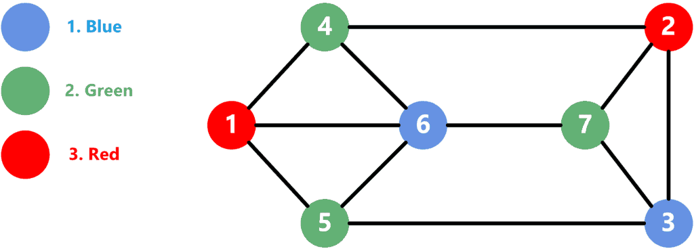

### Definitions:
1. **Vertex Coloring**: Assigning a color to each vertex in a graph
2. **Proper**: A vertex is proper if every adjacent vertex are colored differently than the center vertex
3. **CHromatic Number**: The smallest number of unqiue colors that makes every vertex in a graph proper

> [!Note]
> The chromatic number of a graph $G$ is written as $\chi (G)$

## The Four Color Theorem
**The Four Color Thereom states that the chromatic number of a planar graph is always less than or equal to 4.**

### Proof of the Four Color Theorem

The book doesn't go deep into the proof due to its complexity. I was planning on demonstrating the proof (which can be found [here](https://github.com/coq-community/fourcolor)) using some proof assitance software, but it proved to be too unwieldy to actually present. The book says that the proof relies on reducing the possible configurations of graphs to a set of 633, and although this is true the computer actually has to check over a billion situations to properly verify the proof not just the 633.

#### Example
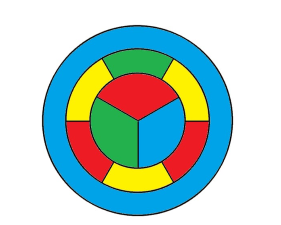

## Brooks' Theorem
Any graph $G$ satisfies $\chi(G) \le \Delta(G)\text{,}$ unless $G$ is a complete graph or an odd cycle, in which case $\chi(G) = \Delta(G) + 1\text{.}$.

In other words any graph that is not a complete graph or odd cycle will have a maximum chromatic number that is equal or less than the largest degree of a vertice in a graph. 

This can be seen in the following graph:
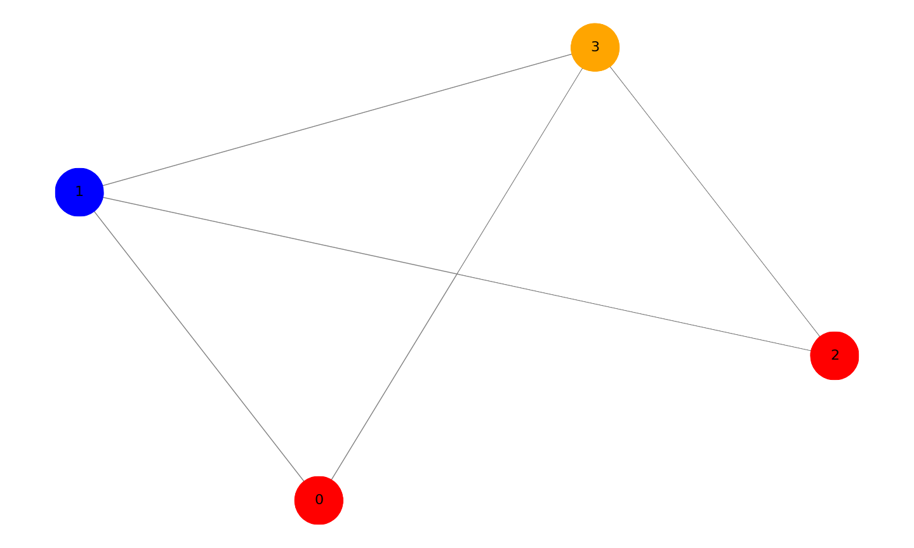
The highest number of degrees of the vertices is 3 and the necessary colors to properly color is 3.

The two exceptions to this theoreom are demonstrated by the following graphs:
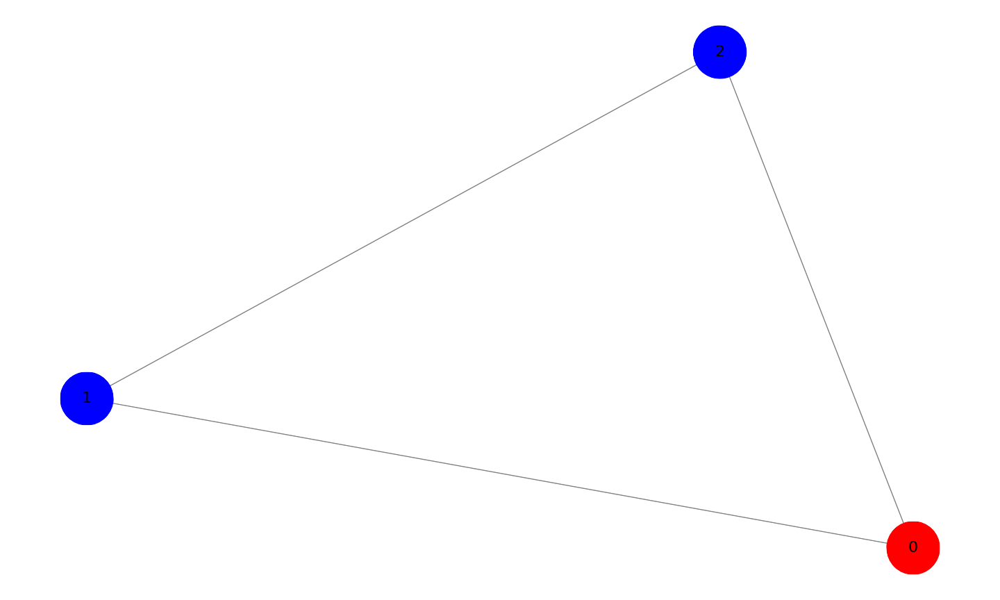
This is a graph with an odd cycle, which due to that aspect requieres for a color more than the highest degree for the vertices of the graph, 2.

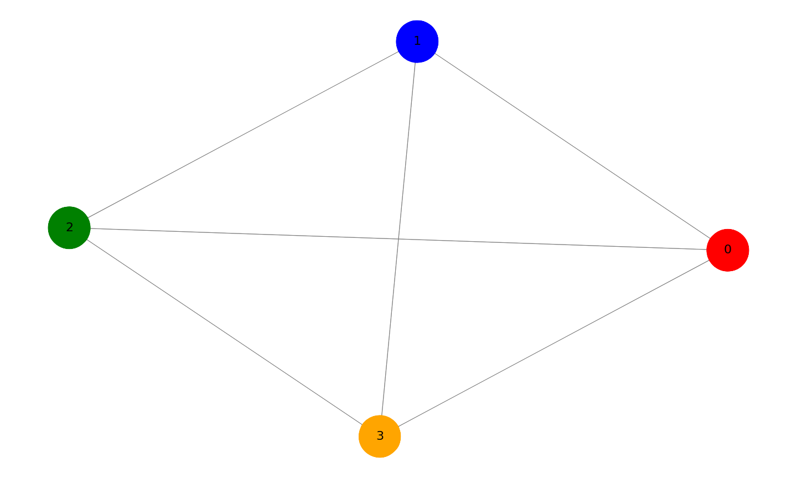
This is graph $K_4$ and due to completed graphs having all vertices connecting to every other vertices this means that all vertices need to have a different color as otherwise they wouldn't be properly colored. The highest degree for the vertices is 3 while we need 4 different colors to properly color the graph, demonstrating th exception in Brook's Theorem.

## Coloring Edges:
<b>Vizing's Theorem</b>: Vizing's Theorem is a key result in graph theory concerning the edge coloring of simple graphs. It states that for
any simple graph  $G$, the chromatic index $x'(G)$, which is the minimum number of colors needed to color the edges such that no two
edges sharing a vertex have the same color, is either $\Delta(G)$ or $\Delta(G) + 1$, where $\Delta(G)$ is the maximum degree of
any vertex in the graph. This means the number of colors required will be at most one more than the maximum number of edges incident to any
vertex.

<b>Ramsey Theory</b>: is the coloring of graphs with the aim of avoiding monochromatic subgraphs, such as triangles. For instance, when
coloring edges of $K_n$ (complete graphs) either red or blue, some graphs like $K_4$ can avoid forming a monochromatic triangle, but others
like $K_5$ cannot. The theory extends to using more colors and larger subgraphs, though much remains unknown. For example, it’s known that
$K_{17}$ is the smallest graph forcing a monochromatic triangle with three colors, and $K_{18}$ is the smallest for forcing a monochromatic
$K_4$ with two colors. However, the exact size required to force a monochromatic $K_5$ remains uncertain, estimated to be between $K_{43}$
and $K_{49}$. This area of graph theory is rich with open questions and is known as Ramsey's Theory.

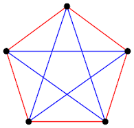

## 7. The two problems below can be solved using graph coloring. For each problem, represent the situation with a graph, say whether you should be coloring vertices or edges and why, and use the coloring to solve the problem.

a. Your Quidditch league has 5 teams. You will play a tournament next week in which every team will play every other team once. Each team can play at most one match each day, but there is plenty of time in the day for multiple matches. What is the fewest number of days over which the tournament can take place?

.png)

> It would be 5 days since each of the 5 colors would represent the 5 days and the edges would represent the 2 days that they can play per day.  

b. Ten members of Math Club are driving to a math conference in a neighboring state. However, some of these students have dated in the past, and things are still a little awkward. Each student lists which other students they refuse to share a car with; these conflicts are recorded in the table below. What is the fewest number of cars the club needs to make the trip? Do not worry about running out of seats, just avoid the conflicts.

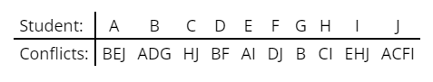

$Vertex set: {A,B,C,D,E,F,G,H,I,J}$

$Edge set: (A−B),(A−E),(A−J),(B−A),(B−D),(B−G),(C−H),(C−J),(D−B),(D−F),(E−A),$
$(E−I),(F−D),(F−J),(G−B),(H−C),(H−I),(I−E),(I−H),(I−J),(J−A),(J−C),(J−F),(J−I)$

> We use the conflicting sets that conflict to make our graphs

$Conflictsets:{(A−B),(A−E),(A−J),(B−D),(B−G),(C−H),(C−J),(D−F),(E−I),(F−J),(H−I)}$

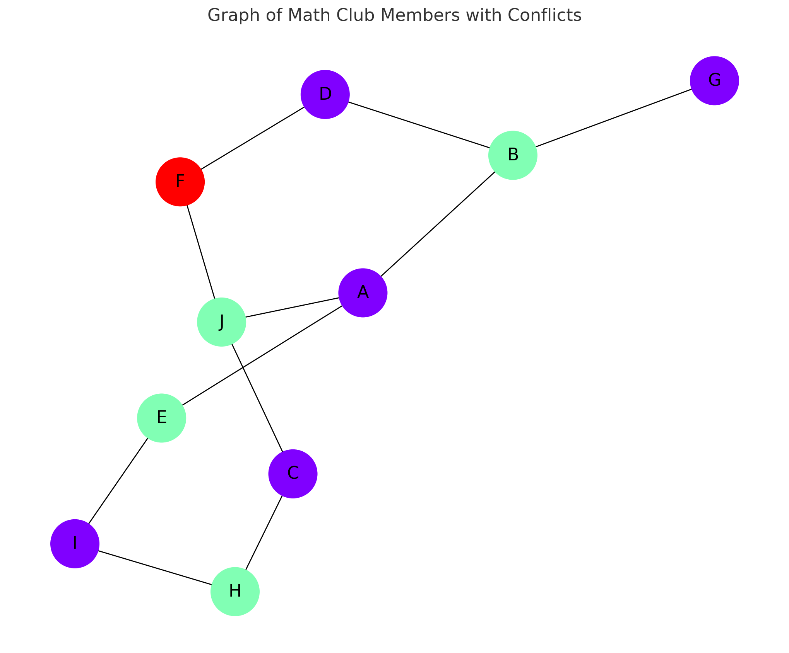

## 9. Not all graphs are perfect. Give an example of a graph with chromatic number 4 that does not contain a copy of $K_4$. That is, there should be no 4 vertices all pairwise adjacent.
The wheel graph below has this property. The outside of the wheel forms an odd cycle, so requires 3 colors, the center of the wheel must be different than all the outside vertices.

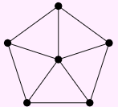

## 10. Find the chromatic number of the graph below and prove you are correct.
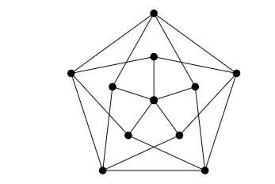

This is a Grötzsch graph and it has the following properties: 11 vertices and 20 edges. It is triangle-free and it has a chromatic number of 4. 
The graph can be constructed by taking a 5-cycle and replacing each vertex with a "fan" of three vertices.

Let's attempt to color the vertices using 3 colors: Red (R), Blue (B), and Green (G).

Assign color to vertex 0:

Without loss of generality, color vertex 0 with Red (R).
Assign colors to adjacent vertices 1, 2, 3, 4:

Vertices 1, 2, 3, and 4 must be colored with either Blue (B) or Green (G) since they are all adjacent to vertex 0.
Suppose vertex 1 is Blue (B), vertex 2 is Green (G), vertex 3 is Blue (B), and vertex 4 is Green (G).
Continue with vertices 5, 6, 7, 8, 9, 10:

Vertex 5 must be adjacent to vertices 1 (B) and 2 (G), so it must be Red (R).
Vertex 6 must be adjacent to vertices 1 (B) and 3 (B), creating a conflict since both adjacent vertices have the same color and cannot use either Blue (B) or Green (G). Thus, vertex 6 cannot be colored with Red (R).
At this point, we encounter a contradiction:

Vertex 6 is adjacent to two vertices (1 and 3), both of which are Blue (B). According to our assumption, we cannot color vertex 6 with Blue (B) or Green (G) because both colors are already used by its adjacent vertices.
 
This contradiction demonstrates that Grötzsch graph is not 3-colorable

what is left to do is show that the Grötzsch graph has a chromatic number of four by 

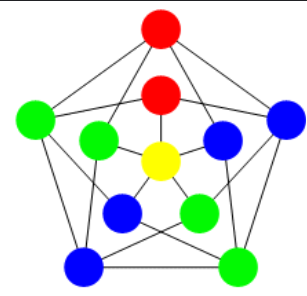

## 4. A group of 10 friends decides to head up to a cabin in the woods (where nothing could possibly go wrong). Unfortunately, a number of these friends have dated each other in the past, and things are still a little awkward. To get to the cabin, they need to divide up into some number of cars, and no two people who dated should be in the same car.

### A. What is the smallest number of cars you need if all the relationships were strictly heterosexual? Represent an example of such a situation with a graph. What kind of graph do you get?

If all relationships were strictly heterosexual then one representation of this would be the following:

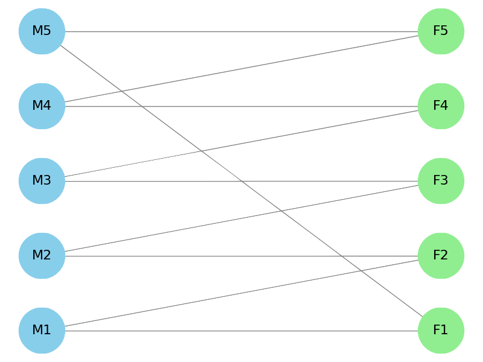

If we look at this for a bit we will realize this is a bipartite graph. After all, bipartite graphs are graphs where we can divide the vertices into 2 sets of the vertices where they only connect to vertices from the other set, and we can color the graph's vertices using only 2 colors. These two sets are males and females as we are considering only heterosexual relationships between the 10 friends. Therefore the smallest number of cars is 2.

### B. Because a number of these friends dated there are also conflicts between friends of the same gender, listed below. Now what is the smallest number of conflict-free cars they could take to the cabin?

|  Friend  | A   | B   | C   | D   |  E   | F   | G   | H   | I   | J   |
|----------|-----|-----|-----|-----|------|-----|-----|-----|-----|-----|
| Conflicts:| CFG | J| AEF | H | CFG| ACEGI | EFI|D|AFG|B|

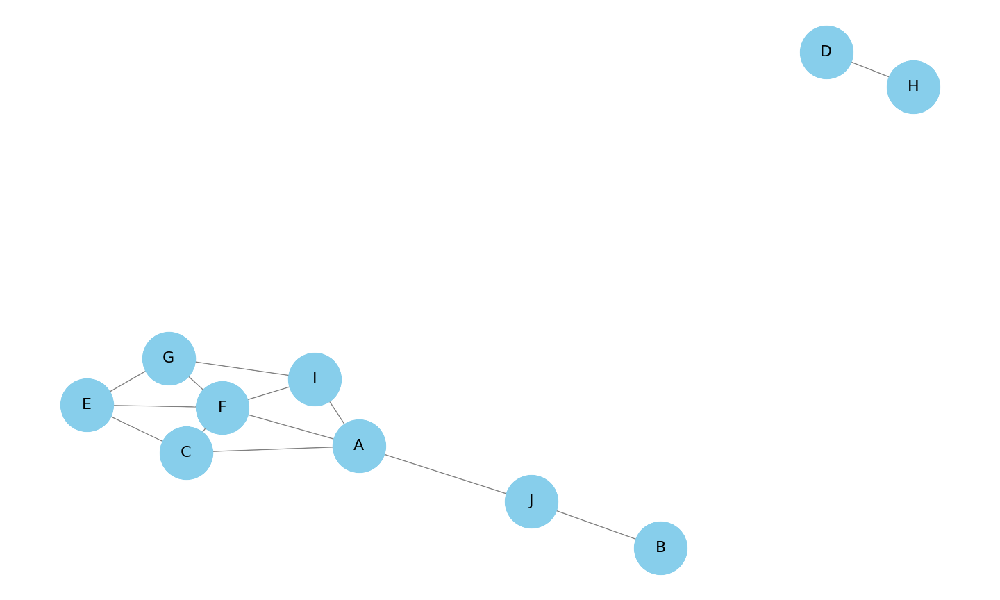

This graph is planar as none of the edges cross eachother. Therefore using The Four Color Theorem we know that the maximum amount of colors needed would be 4. Moreover, we see there is a cllique of 3 (a complete graph $K_3$) so the minimum amount of colors needed is 3. To actually find out how much needed we can evaluate this graph with this new information, however we can also solve is using networkx greedy coloring algorithm.

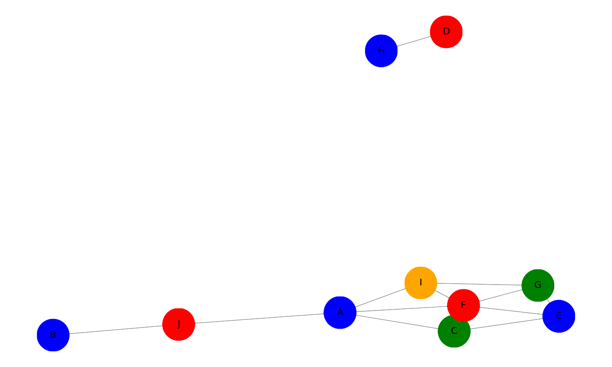

## 5.What is the smallest number of colors that can be used to color the vertices of a cube so that no two adjacent vertices are colored identically?

To begin to solve this we first want to see if we can represent a cube as a planar graph. After all, this will then limit the maximum colors needed to four. Turns out we can!

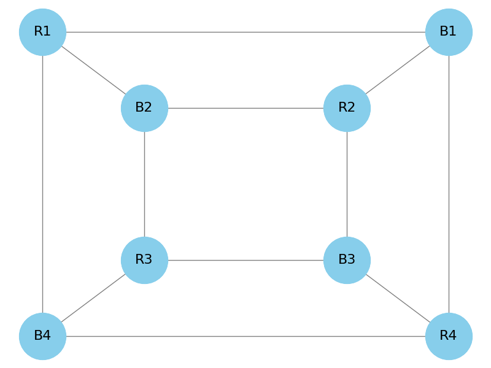

Now we want to see if there are any cliques (complete graphs) to see if there is a minimum. There is actually only a clique of 2 present in this graph meaning the minimum is 2 colors.

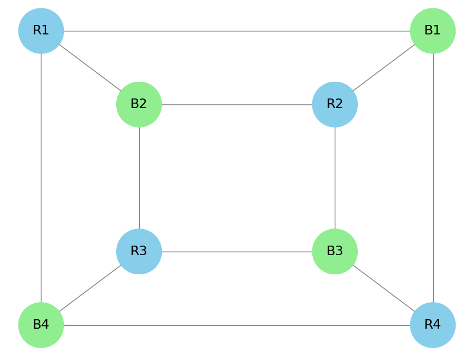

## 13. Suppose you colored edges of a graph either red or blue (not requiring that adjacent edges be colored differently). What must be true of the graph to guarantee some vertex is incident to three edges of the same color? Prove your answer.

    Suppose we have a graph with a vertex that has a degree of 5. Then as the edges in this graph can be either colored red or blue, by the fourth colored edge, if we haven't yet reached three edges of the same color, there must be 2 edges colored blue and 2 red. Therefore, no matter what color we give the fifth edge there will be some vertex incident to three edges of the same color (pigeonhole principle). This implies that what must be true of a graph to gurantee a vertex being incident to three degrees of the same color is that there is a vertex of degree 5. 

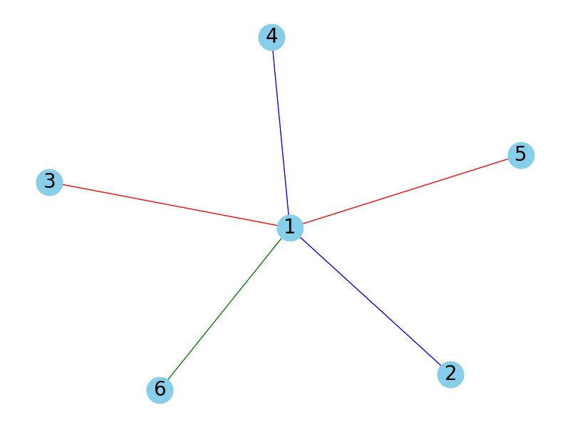

##  14. Prove that if you color every edge of $K_6$ either red or blue, you are guaranteed a monochromatic triangle (that is, an all red or an all blue triangle).

    Suppose we have complete graph $K_6$. This means that a vertex $V$ is connected to three other vertices by edges of the same color. Assume these vertices are *A*, *B* and *C*, as this is a complete graph the 3 vertices are connected to eachother in a manner that they are a triangle, meaning there are 3 edges between themselves. Therefore, as they can only be colored as red or blue one of these three edges between them must be the same color of the edge that they are connected to vertex *V* by. Otherwise if the vertices between them were all the same color then that in itself would be the monochromatic triangle. Thus proving that coloring the edges of $K_6$ no matter what will gurantee a monochromatic triangle.

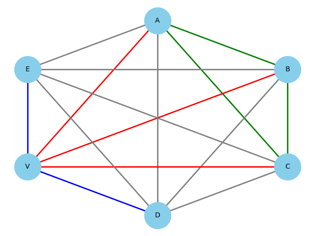

To help further prove this I created a python program that randomizes the edge colors from either red or blue. Thus if we run this program we should also be able to see a triangle.  [Randomizer](randomk6.py)

### Sources:
- [Wiki Graph Coloring](https://en.wikipedia.org/wiki/Graph_coloring) 
- [Wiki Ramsey Theory](https://en.wikipedia.org/wiki/Ramsey_theory)
 - https://en.wikipedia.org/wiki/Graph_coloring
 - https://github.com/coq-community/fourcolor
 - https://inria.hal.science/hal-04034866/document