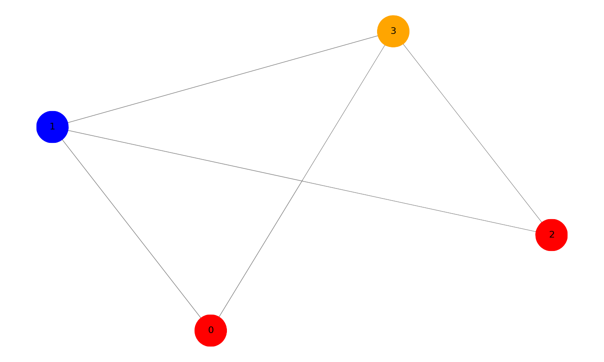
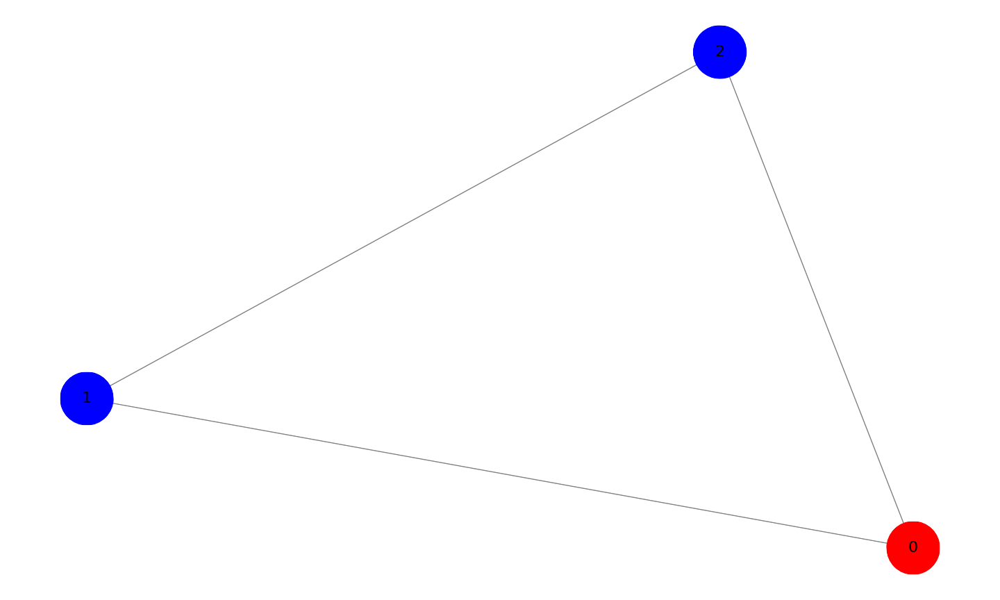
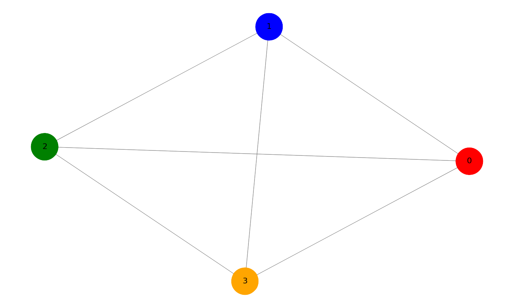
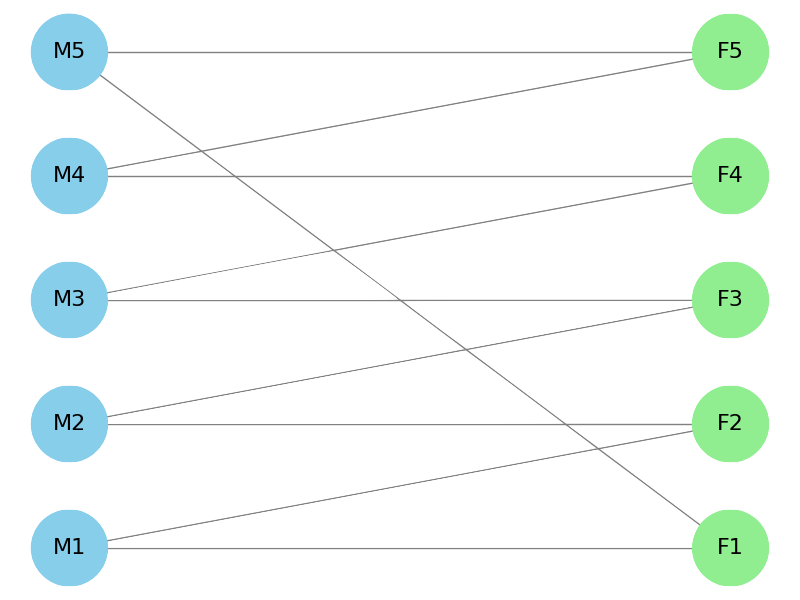
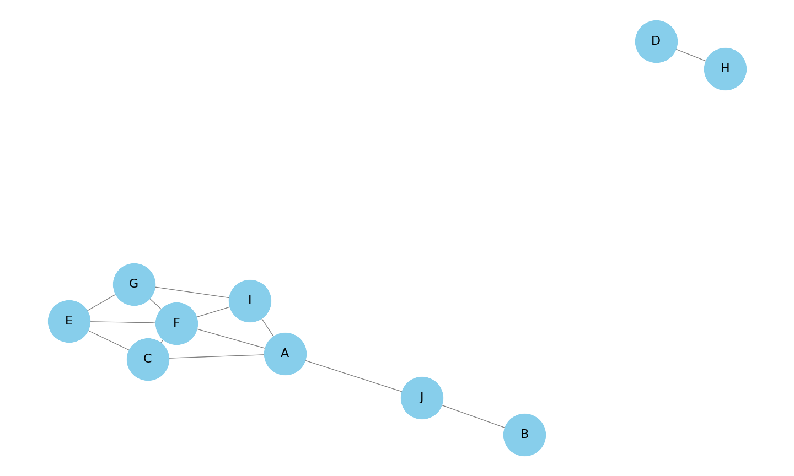
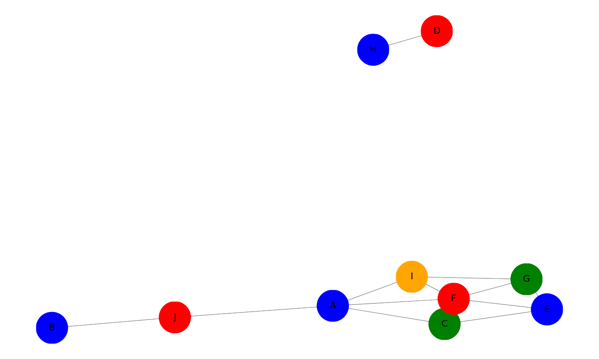
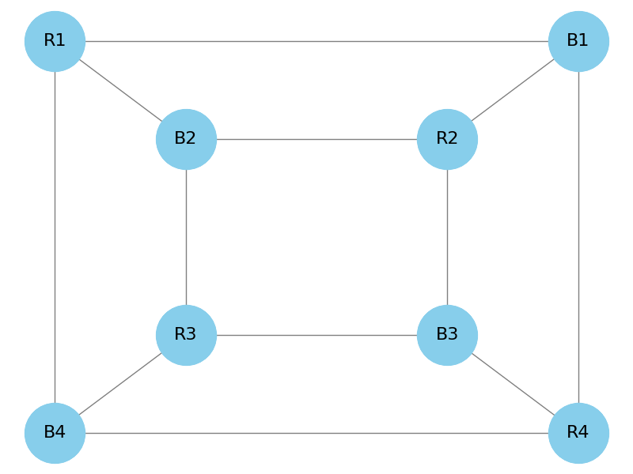
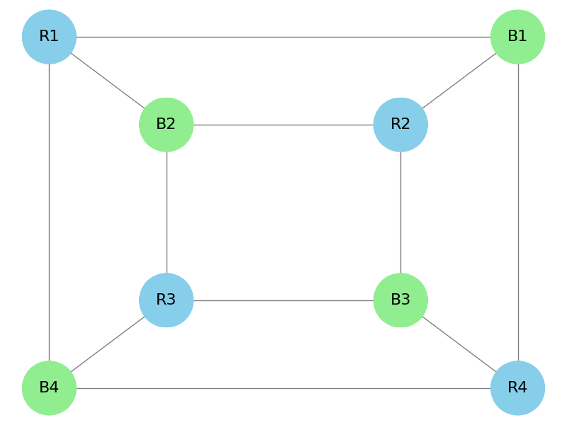
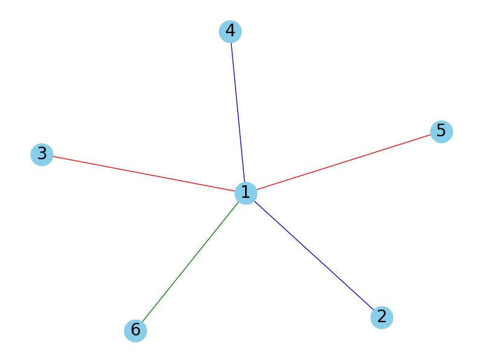

## Brooks' Theorem
Any graph $G$ satisfies $\chi(G) \le \Delta(G)\text{,}$ unless $G$ is a complete graph or an odd cycle, in which case $\chi(G) = \Delta(G) + 1\text{.}$.

In other words any graph that is not a complete graph or odd cycle will have a maximum chromatic number that is equal or less than the largest degree of a vertice in a graph. 

This can be seen in the following graph:

The highest number of degrees of the vertices is 3 and the necessary colors to properly color is 3.

The two exceptions to this theoreom are demonstrated by the following graphs:

This is a graph with an odd cycle, which due to that aspect requieres for another color more than the highest degree for the vertices of the graph, 2.

This is graph $K_4$ and due to completed graphs having all vertices connecting to every other vertices this means that all vertices need to have a different color as otherwise they wouldn't be properly colored. The highest degree for the vertices is 3 while we need 4 different colors to properly color the graph, demonstrating th exception in Brook's Theorem.

## 4. A group of 10 friends decides to head up to a cabin in the woods (where nothing could possibly go wrong). Unfortunately, a number of these friends have dated each other in the past, and things are still a little awkward. To get to the cabin, they need to divide up into some number of cars, and no two people who dated should be in the same car.

### A. What is the smallest number of cars you need if all the relationships were strictly heterosexual? Represent an example of such a situation with a graph. What kind of graph do you get?

If all relationships were strictly heterosexual then one representation of this would be the following:

If we look at this for a bit we will realize this is a bipartite graph. After all, bipartite graphs are graphs where we can divide the vertices into 2 sets of the vertices where they only connect to vertices from the other set, and we can color the graph's vertices using only 2 colors. These two sets are males and females as we are considering only heterosexual relationships between the 10 friends. Therefore the smallest number of cars is 2.

### B. Because a number of these friends dated there are also conflicts between friends of the same gender, listed below. Now what is the smallest number of conflict-free cars they could take to the cabin?

|  Friend  | A   | B   | C   | D   |  E   | F   | G   | H   | I   | J   |
|----------|-----|-----|-----|-----|------|-----|-----|-----|-----|-----|
| Conflicts:| CFG | J| AEF | H | CFG| ACEGI | EFI|D|AFG|B|

This graph is planar as none of the edges cross eachother. Therefore using The Four Color Theorem we know that the maximum amount of colors needed would be 4. Moreover, we see there is a cllique of 3 (a complete graph $K_3$) so the minimum amount of colors needed is 3. To actually find out how much needed we can evaluate this graph with this new information, however we can also solve is using networkx greedy coloring algorithm.

## 5.What is the smallest number of colors that can be used to color the vertices of a cube so that no two adjacent vertices are colored identically?

To begin to solve this we first want to see if we can represent a cube as a planar graph. After all, this will then limit the maximum colors needed to four. Turns out we can!

Now we want to see if there are any cliques (complete graphs) to see if there is a minimum. There is actually only a clique of 2 present in this graph meaning the minimum is 2 colors.

## 13. Suppose you colored edges of a graph either red or blue (not requiring that adjacent edges be colored differently). What must be true of the graph to guarantee some vertex is incident to three edges of the same color? Prove your answer.

    Suppose we have a graph with a vertex that has a degree of 5. Then as the edges in this graph can be either colored red or blue, by the fourth colored edge, if we haven't yet reached three edges of the same color, there must be 2 edges colored blue and 2 red. Therefore, no matter what color we give the fifth edge there will be some vertex incident to three edges of the same color (pigeonhole principle). This implies that what must be true of a graph to gurantee a vertex being incident to three degrees of the same color is that there is a vertex of degree 5. 

##  14. Prove that if you color every edge of $K_6$ either red or blue, you are guaranteed a monochromatic triangle (that is, an all red or an all blue triangle).

    Suppose we have complete graph $K_6$. This means that a vertex $V$ is connected to three other vertices by edges of the same color. Assume these vertices are *A*, *B* and *C*, as this is a complete graph the 3 vertices are connected to eachother in a manner that they are a triangle, meaning there are 3 edges between themselves. Therefore, as they can only be colored as red or blue one of these three edges between them must be the same color of the edge that they are connected to vertex *V* by. Otherwise if the vertices between them were all the same color then that in itself would be the monochromatic triangle. Thus proving that coloring the edges of $K_6$ no matter what will gurantee a monochromatic triangle.
